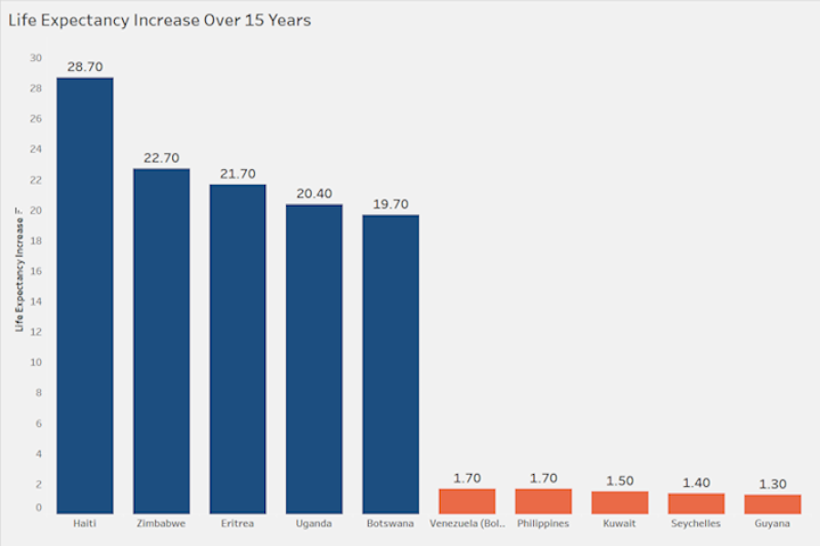

# World Life Expectancy: Data Cleaning, Analysis, and Visualization

**Table of Contents**

- [Project Overview](#project-overview)
- [Part 1: Data Cleaning](#part-1-data-cleaning)
    - [Step 1: Identifying Duplicates in the Data](#step-1-identifying-duplicates-in-the-data)
    - [Step 2: Removing Duplicates From the Data](#step-2-removing-duplicates-from-the-data)
    - [Step 3: Investigating the Blank Values in the Status Column](#step-3-investigating-the-blank-values-in-the-status-column)
    - [Step 4: Filling in the Blank Values in the Status Column](#step-4-filling-in-the-blank-values-in-the-status-column)
    - [Step 5: Investigating the Blank Values in the Life Expectancy Column](#step-5-investigating-the-blank-values-in-the-life-expectancy-column)
    - [Step 6: Filling in the Blank Values in the Life Expectancy Column](#step-6-filling-in-the-blank-values-in-the-life-expectancy-column)
- [Part 2: Exploratory Data Analysis](#part-2-exploratory-data-analysis)
    - [Step 1: Which Countries Have Improved the Most and Least in Life Expectancy?](#step-1-which-countries-have-improved-the-most-and-least-in-life-expectancy)
    - [Step 2: What is the Average Life Expectancy Per Year?](#step-2-what-is-the-average-life-expectancy-per-year)
    - [Step 3: Is There a Correlation Between GDP and Life Expectancy?](#step-3-is-there-a-correlation-between-gdp-and-life-expectancy)
    - [Step 4: Is There a Correlation Between Status and Life Expectancy?](#step-4-is-there-a-correlation-between-status-and-life-expectancy)
    - [Step 5: Is There a Correlation Between BMI and Life Expectancy?](#step-5-is-there-a-correlation-between-bmi-and-life-expectancy)
    - [Step 6: Is There a Correlation Between Adult Mortality and Life Expectancy?](#step-6-is-there-a-correlation-between-adult-mortality-and-life-expectancy)
- [Part 3: Data Visualization](#part-3-data-visualization)
    - [Link to the Tableau Public Workbook](#link-to-the-tableau-public-workbook)
    - [The Top 5 and Bottom 5 Countries in Life Expectancy Increase](#the-top-5-and-bottom-5-countries-in-life-expectancy-increase)
    - [The Top 5 and Bottom 5 Countries in Average GDP](#the-top-5-and-bottom-5-countries-in-average-gdp)
    - [The Top 5 and Bottom 5 Countries in Average BMI](#the-top-5-and-bottom-5-countries-in-average-bmi)
    - [Interactive Dashboard of Global Indicators](#interactive-dashboard-of-global-indicators)
- [Conclusion](#conclusion)

<br>

# Project Overview

This project was completed in MySQL Workbench and Tableau Desktop. In this project, I was looking at a dataset that contained information about life expectancy around the world, along with many other global health indicators. The first goal of this project was to identify issues in the dataset and clean the data as much as possible. The second goal of this project was to explore variations in life expectancy across different countries and examine if other indicators correlate, whether positively or negatively, with life expectancy. The third goal of this project was a make an interactive dashboard with the data in the project. The overall goal of this project wasn't to provide a recommendation like many of my other projects are - the goal was simply to become familiar with the dataset, which is an important skill for any data analyst. The tasks completed in this project include:

- Used the CONCAT() function to engineer a unique column that could be used to check for the existence of duplicates
- Wrote complex SQL queries that used window functions and self-joins to remove duplicates and fill in blanks where possible
- Conducted exploratory data analysis (EDA) to identify patterns and trends in life expectancy over time and across different geographic regions
- Examined the relationship between life expectancy and various socio-economic indicators such as GDP, BMI, and Adult Mortality
- Researched global indicators such as Adult Mortality to contextualize my findings and enhance understanding of the factors influencing life expectancy
- Used Tableau parameters and sets to create an interactive dashboard where the user can see the best and worst-performing countries in certain metrics


<br>
<br>

------------------------------------------------------------------------

# Part 1: Data Cleaning

### Step 1: Identifying Duplicates in the Data
While there isn't a unique identifier column in this dataset, looking at the **Country** and **Year** fields together will help identify duplicates. Each country should only have one row in the dataset per year.
- Using the CONCAT() function to combine the country and year creates a field that has (or at least should have) unique values for each row. Using the COUNT() function on the result tells us how many times each combination appears.
- Grouping on country and year will then output a count for each row. We can then use the HAVING keyword to filter on the aggregation - any row that has a count greater than 1 is a duplicate.

``` SQL
SELECT 
    country, 
    year,
    COUNT(CONCAT(country, year)) AS duplicates
FROM 
    world_life_expectancy
GROUP BY
    country, 
    year
HAVING 
    duplicates > 1;
 ```
    
Output Table:
| country  | year | duplicates |
| :------- | :--- | :--------- |
| Ireland  | 2022 | 2          |
| Senegal  | 2009 | 2          |
| Zimbabwe | 2019 | 2          |

<br>

### Step 2: Removing Duplicates From the Data
There are only three duplicates in the data, so it would be very easy to identify the **Row_ID** of each and simply drop them. However, when dealing with millions of rows of data where there could be hundreds or thousands of duplicates, this is not a feasible solution. Instead, a query can be written to identify all the duplicate rows and delete them from the table.
- The innermost query is using the ROW_NUMBER() window function to assign a row number to each combination of country/year, which we achieved with the CONCAT() function. A non-duplicate record will have a row number of 1, while any duplicate records will be assigned a row number greater than 1.
- To filter to records where the row number is greater than 1, the query where we assigned the row numbers must be used as a subquery. We SELECT the row_id from that query, but only WHERE the row number is greater than 1.
- Finally, the outermost query deletes records from world_life_expectancy where the row_id of the record is found within the queries that check for duplicates - this deletes the 3 duplicate records and would delete any others if there had been more.

``` SQL
DELETE FROM world_life_expectancy
WHERE row_id IN (
    SELECT 
        row_id
    FROM (
        SELECT
            row_id,
            CONCAT(country, year),
            ROW_NUMBER() OVER(PARTITION BY CONCAT(country, year) ORDER BY CONCAT(country, year)) AS row_num
        FROM 
            world_life_expectancy
        ) AS unique_row_table
    WHERE row_num > 1
);
```

<br>

### Step 3: Investigating the Blank Values in the Status Column
While glancing over the dataset, I noticed a blank value in the **Status** column. Let's identify all the rows that are missing a status.

``` SQL
SELECT 
    country,
    year,
    status
FROM 
    world_life_expectancy
WHERE 
    status = '';
```

Output Table:
| country                  | year | status |
| :----------------------- | :--- | :----- |
| Afghanistan              | 2014 |        |
| Albania                  | 2021 |        |
| Georgia                  | 2012 |        |
| Georgia                  | 2010 |        |
| United States of America | 2021 |        |
| Vanuatu                  | 2020 |        |
| Zambia                   | 2016 |        |
| Zambia                   | 2012 |        |

There are a good chunk of rows missing a status. Let's see what type of data goes into the **Status** column to see if we might be able to fill those missing values in.

``` SQL
SELECT
    DISTINCT(status)
FROM 
    world_life_expectancy
WHERE 
    status <> '';
```

Output Table:

| status     |
| :--------- |
| Developing |
| Developed  |

<br>

### Step 4: Filling in the Blank Values in the Status Column
We've discovered that the **Status** column keeps track of whether a country is developing or developed - it should be possible to fill in those blank values by looking at a country's status from previous years.
- I originally attempted to accomplish this with a subquery but ended up getting the desired output by self-joining the data on country instead. I set the status of the first table equal to developing, but only on the condition that in the second table, there existed a record where the status was not blank, and also equal to developing.
- To summarize, the query connects the country in both tables - if the country has a value for the **Status** column in the second table, it can fill in the blanks in the first table with that same value. I used a similar query to fill in the developed countries as well, so the **Status** column now has zero blanks.

``` SQL
UPDATE
    world_life_expectancy AS wle1
INNER JOIN 
    world_life_expectancy AS wle2
    ON wle1.country = wle2.country
SET
    wle1.status = 'Developing'
WHERE
    wle1.status = ''
    AND wle2.status <> ''
    AND wle2.status = 'Developing';
```

``` SQL
UPDATE
    world_life_expectancy AS wle1
INNER JOIN 
    world_life_expectancy AS wle2
    ON wle1.country = wle2.country
SET
    wle1.status = 'Developed'
WHERE
    wle1.status = ''
    AND wle2.status <> ''
    AND wle2.status = 'Developed';
```

<br>

### Step 5: Investigating the Blank Values in the Life Expectancy Column
While looking over the dataset, I also noticed a blank in the **Life Expectancy** column. Let's take a look at all of the rows missing a life expectancy value.

``` SQL
SELECT 
    country,
    year,
    `Life expectancy`
FROM 
    world_life_expectancy
WHERE 
    `Life expectancy` = '';
```

Output Table:

| country     | year | Life expectancy |
| :---------- | :--- | :-------------- |
| Afghanistan | 2018 |                 |
| Albania     | 2018 |                 |

There are only a couple of rows missing values for **Life Expectancy**, but this one won't be as straightforward to fill in as **Status** was. Let's take a look at the life expectancy values for both countries to see if the values follow a pattern.

``` SQL
SELECT 
    country,
    year,
    `Life expectancy`
FROM 
    world_life_expectancy
WHERE
    country = 'Afghanistan'
LIMIT 
    10;
```

Output Table:

| country     | year | Life expectancy |
| :---------- | :--- | :-------------- |
| Afghanistan | 2022 | 65              |
| Afghanistan | 2021 | 59.9            |
| Afghanistan | 2020 | 59.9            |
| Afghanistan | 2019 | 59.5            |
| Afghanistan | 2018 |                 |
| Afghanistan | 2017 | 58.8            |
| Afghanistan | 2016 | 58.6            |
| Afghanistan | 2015 | 58.1            |
| Afghanistan | 2014 | 57.5            |
| Afghanistan | 2013 | 57.3            |

``` SQL
SELECT 
    country,
    year,
    `Life expectancy`
FROM 
    world_life_expectancy
WHERE
    country = 'Albania'
LIMIT 
    10;
```

Output Table:

| country | year | Life expectancy |
| :------ | :--- | :-------------- |
| Albania | 2022 | 77.8            |
| Albania | 2021 | 77.5            |
| Albania | 2020 | 77.2            |
| Albania | 2019 | 76.9            |
| Albania | 2018 |                 |
| Albania | 2017 | 76.2            |
| Albania | 2016 | 76.1            |
| Albania | 2015 | 75.3            |
| Albania | 2014 | 75.9            |
| Albania | 2013 | 74.2            |

<br>

### Step 6: Filling in the Blank Values in the Life Expectancy Column
While filling in blank values with estimations is not always advisable, it makes sense to do it here. There are only a couple of blank rows, and the life expectancy values are following a consistent pattern - they tick up slightly over the years. To estimate the missing value, we can add the life expectancy from the prior year to the life expectancy from the following year and divide by two to calculate the average. This will get us a value directly in between those two values - it may not be exact, but it will be a good estimate of the missing life expectancy value.
- I did a double self-join to solve this problem. The first table is the base table with the blank, while the second table subtracts 1 from the year, meaning it has the life expectancy value from the previous year rather than a blank. The third table adds 1 to the year, meaning it has the life expectancy value from the following year rather than a blank.
- I added the life expectancy values from the second and third tables and divided by 2 to get the average of the two values - I also used the ROUND() function to round to 1 decimal place, making our new value uniform with the rest of the life expectancy values in the table. Finally, I updated the table and set the **Life Expectancy** column in the first table equal to the new value we just calculated - of course, I only applied the calculation to rows that had blanks. This filled in all the blanks in the **Life Expectancy** column.

``` SQL
UPDATE world_life_expectancy AS wle1
INNER JOIN world_life_expectancy AS wle2
    ON wle1.country = wle2.country
    AND wle1.year = wle2.year - 1
INNER JOIN world_life_expectancy AS wle3
    ON wle1.country = wle3.country
    AND wle1.year = wle3.year + 1
SET wle1.`Life expectancy` = ROUND((wle2.`Life expectancy` + wle3.`Life expectancy`) / 2, 1)
WHERE wle1.`Life expectancy` = '';
```

With that, I'm finished cleaning the dataset! All duplicates are removed and all blank values are filled in. While the dataset looks clean at a glance, it's possible that during the exploratory data analysis portion of the project, I'll discover some other harder-to-spot issues that need to be fixed. This is a normal part of the process and I'll deal with any other issues as needed! Let's get into some analysis and insights.

<br>
<br>

------------------------------------------------------------------------

# Part 2: Exploratory Data Analysis

### Step 1: Which Countries Have Improved the Most and Least in Life Expectancy?
- Note: I added the HAVING clause that removes zero values because there were a handful of countries that had no life expectancy data at all, they had all 0's in that column. These weren't values that I could fix as I did in Part 1 of the project - I would have to do an investigation into how the data was collected to understand why those values were missing and see if I could recover the missing data. Unfortunately, I was unable to do that in the context of this project, so they got filtered out instead!

``` SQL
SELECT 
    country,
    MIN(`Life expectancy`) AS min_life_expectancy,
    MAX(`Life expectancy`) AS max_life_expectancy,
    ROUND(MAX(`Life expectancy`) - MIN(`Life expectancy`), 1) AS life_increase_15_years
FROM 
    world_life_expectancy
GROUP BY
    country
HAVING
    min_life_expectancy <> 0
    AND max_life_expectancy <> 0
ORDER BY
    life_increase_15_years DESC
LIMIT 
    5;
```

Output Table:

| country  | min_life_expectancy | max_life_expectancy | life_increase_15_years |
| :------- | :------------------ | :------------------ | :--------------------- |
| Haiti    | 36.3                | 65                  | 28.7                   |
| Zimbabwe | 44.3                | 67                  | 22.7                   |
| Eritrea  | 45.3                | 67                  | 21.7                   |
| Uganda   | 46.6                | 67                  | 20.4                   |
| Botswana | 46                  | 65.7                | 19.7                   |

``` SQL
SELECT 
    country,
    MIN(`Life expectancy`) AS min_life_expectancy,
    MAX(`Life expectancy`) AS max_life_expectancy,
    ROUND(MAX(`Life expectancy`) - MIN(`Life expectancy`), 1) AS life_increase_15_years
FROM 
    world_life_expectancy
GROUP BY
    country
HAVING
    min_life_expectancy <> 0
    AND max_life_expectancy <> 0
ORDER BY
    life_increase_15_years ASC
LIMIT 
    5;
```

Output Table:

| country                            | min_life_expectancy | max_life_expectancy | life_increase_15_years |
| :--------------------------------- | :------------------ | :------------------ | :--------------------- |
| Guyana                             | 65                  | 66.3                | 1.3                    |
| Seychelles                         | 71.8                | 73.2                | 1.4                    |
| Kuwait                             | 73.2                | 74.7                | 1.5                    |
| Philippines                        | 66.8                | 68.5                | 1.7                    |
| Venezuela (Bolivarian Republic of) | 72.4                | 74.1                | 1.7                    |


Insights 
- Haiti, Zimbabwe, Eritrea, Uganda, and Botswana are the top five biggest improvers in terms of life expectancy over the last fifteen years. Haiti's life expectancy has increased by nearly thirty years, while the other countries in the top five have all increased by roughly twenty years, give or take. On the other hand, the countries that have improved the least in life expectancy are Guyana, Seychelles, Kuwait, Philippines, and Venezuela. Each of those countries saw an improvement of less than two years over the last fifteen years. 
- Something important to note is that the minimum life expectancy between the top five and the bottom five has large variations. The top five started with life expectancies in the range of 36-46 years, while the bottom five started with life expectancies in the range of 65-73 years. If you look at the maximum life expectancy, the top five improvers are in the range of 65-67 while the bottom five are in the range of 66-74. The bottom five improvers still have a higher life expectancy overall even if they've improved less - the top five improvers started with such a low life expectancy that it was likely easier for them to see larger improvement.

<br>

### Step 2: What is the Average Life Expectancy Per Year?

``` SQL
SELECT
    year,
    ROUND(AVG(`Life expectancy`), 2) AS avg_life_expectancy
FROM
    world_life_expectancy
WHERE
    `Life expectancy` <> 0
GROUP BY
    year
ORDER BY
    year;
```

Output Table:

| year | avg_life_expectancy |
| :--- | :------------------ |
| 2007 | 66.75               |
| 2008 | 67.13               |
| 2009 | 67.35               |
| 2010 | 67.43               |
| 2011 | 67.65               |
| 2012 | 68.21               |
| 2013 | 68.67               |
| 2014 | 69.04               |
| 2015 | 69.43               |
| 2016 | 69.94               |
| 2017 | 70.05               |
| 2018 | 70.65               |
| 2019 | 70.92               |
| 2020 | 71.24               |
| 2021 | 71.54               |
| 2022 | 71.62               |

Insights

- The pattern seen at the country level also sticks at the world level - life expectancy is slowly increasing over the years. The world has gone from an average life expectancy of 66.75 in 2007 to 71.62 in 2022, an increase of 4.87 years in life expectancy over 15 years - that's great! I'm curious to see what the average life expectancy will be hundreds of years from now. Will it keep going up for years to come? Will we eventually hit a plateau? It's an interesting topic to think about!

<br>

### Step 3: Is There a Correlation Between GDP and Life Expectancy?
- Note: Some countries had no data for life expectancy or GDP. The countries without those values were rather small ones in terms of size, so maybe they didn't report their stats. This is another case where understanding the data collection process would help understand why those values are missing and how to retrieve them. For the sake of not throwing off the numbers in this project, I filtered them out!

``` SQL
SELECT 
    country,
    ROUND(AVG(`Life expectancy`), 1) AS avg_life_expectancy,
    ROUND(AVG(GDP), 1) AS avg_gdp
FROM 
    world_life_expectancy
WHERE
    `Life expectancy` <> 0
    AND gdp <> 0
GROUP BY
    country
ORDER BY
    avg_gdp DESC
LIMIT
    5;
```

Output Table:

| country     | avg_life_expectancy | avg_gdp |
| :---------- | :------------------ | :------ |
| Switzerland | 82.3                | 57363.1 |
| Luxembourg  | 80.8                | 53257.1 |
| Qatar       | 77                  | 40748.6 |
| Netherlands | 81.1                | 34964.8 |
| Australia   | 81.8                | 34637.6 |


``` SQL
SELECT 
    country,
    ROUND(AVG(`Life expectancy`), 1) AS avg_life_expectancy,
    ROUND(AVG(GDP), 1) AS avg_gdp
FROM 
    world_life_expectancy
WHERE
    `Life expectancy` <> 0
    AND gdp <> 0
GROUP BY
    country
ORDER BY
    avg_gdp ASC
LIMIT
    5;
```

Output Table:

| country | avg_life_expectancy | avg_gdp |
| :------ | :------------------ | :------ |
| Burundi | 55.5                | 137.9   |
| Malawi  | 49.9                | 237.6   |
| Liberia | 57.5                | 246.3   |
| Eritrea | 59.5                | 259.4   |
| Niger   | 57                  | 259.9   |

Insights

- Even though we're only looking at a small amount of data, there seems to be a positive correlation between the GDP (Gross Domestic Product) and the life expectancy of countries! As GDP goes up, so does life expectancy. This would make sense - richer countries have access to more advanced technologies and products, which would help them live a longer life. However, I want to dig a bit deeper to confirm this correlation truly exists!

- My idea is to use CASE statements to group countries into a low GDP group and a high GDP group. Then, I can average the life expectancy for each group and see if I spot a difference. However, to accomplish this I need to figure out what's considered a low GDP and what's considered a high GDP. To determine this, I decided to order my dataset by GDP, split it down the middle, and base my calculations on the middle value - a loose way of calculating the median of the dataset. Any countries with a GDP greater than or equal to the median value will be considered high-GDP countries, while any countries with a GDP less than the median value will be considered low-GDP countries.

- The base dataset has about 2950 rows, but when filtering out the 0's in the **GDP** column, it loses about 450 rows. Filtering out the 0's in the **Life Expectancy** column loses another 10 rows. That means our filtered dataset has about 2,490 rows, so the middle of the dataset is around 1245.

``` SQL
SELECT
    GDP
FROM
    world_life_expectancy
WHERE
    GDP <> 0
    AND `Life expectancy` <> 0
ORDER BY
    GDP
LIMIT
    1
OFFSET
    1244;
```

Output Table:

| GDP  |
| :--- |
| 1772 |

I then used that median GDP value of 1772 as a basis for the CASE statements in my next query.

``` SQL
SELECT 
    SUM(CASE WHEN GDP >= 1772 THEN 1 ELSE 0 END) AS high_GDP,
    ROUND(AVG(CASE WHEN GDP >= 1772 THEN `Life expectancy` ELSE NULL END), 1) AS high_GDP_life_expectancy,
    SUM(CASE WHEN GDP < 1772 THEN 1 ELSE 0 END) AS low_GDP,
    ROUND(AVG(CASE WHEN GDP < 1772 THEN `Life expectancy` ELSE NULL END), 1) AS low_GDP_life_expectancy
FROM 
    world_life_expectancy
WHERE 
    GDP <> 0
    AND `Life expectancy` <> 0;
```

Output Table:

| high_GDP | high_GDP_life_expectancy | low_GDP | low_GDP_life_expectancy |
| -------- | ------------------------ | ------- | ----------------------- |
| 1241     | 74.7                     | 1244    | 64.1                    |

Insights:

First of all, it seems like the median GDP being 1772 was quite a close guess - the high GDP group has 1241 countries while the low GDP group has 1244 countries, so they're split right down the middle. This query also helps us see the relationship between GDP and life expectancy more clearly. The high GDP group has a life expectancy greater than the low GDP group by over 10 years. With the results of this query, I'm more confident in saying that there's a positive correlation between GDP and life expectancy - the higher the GDP, the higher the life expectancy!

<br>

### Step 4: Is There a Correlation Between Status and Life Expectancy?

``` SQL
SELECT 
    status,
    COUNT(DISTINCT country) AS number_of_countries,
    ROUND(AVG(`Life expectancy`), 1) AS avg_life_expectancy
FROM 
    world_life_expectancy
WHERE
    `Life expectancy` <> 0
GROUP BY
    status;
```

Output Table:

| status     | number_of_countries | avg_life_expectancy |
| :--------- | :------------------ | :------------------ |
| Developed  | 32                  | 79.2                |
| Developing | 151                 | 67.1                |

Insights
- According to this output table, developed countries have an average life expectancy that's over 12 years higher compared to developing countries. However, it is worth it to note the discrepancy between the number of countries in both groups - there are over 100 more developing countries compared to developed countries. There may be developing countries in the mix that have an average life expectancy much higher than 67.1, but their average could be getting dragged down by other countries. It's much easier for developed countries to maintain a higher average when there are fewer of them.
- Unfortunately, this isn't like the GDP where I can split the values down the middle to make the group numbers fair - there are more developing countries than developed countries, and that's a fact I can't change. With the data that's available to us, it can be determined that having a status of developed correlates with a higher life expectancy, while countries with a status of developing have a lower life expectancy.

<br>

### Step 5: Is There a Correlation Between BMI and Life Expectancy?
- Note: You may notice that I've filtered out rows where the BMI is equal to 0. This is another case of me not being able to estimate the missing values - the BMI values are missing for all years in the affected countries, not just one or two. I've filtered out the 0's so they don't throw our numbers off!

``` SQL
SELECT 
    country,
    ROUND(AVG(`Life expectancy`), 1) AS avg_life_expectancy,
    ROUND(AVG(BMI), 1) AS avg_BMI
FROM 
    world_life_expectancy
WHERE
    BMI <> 0
    AND `Life expectancy` <> 0
GROUP BY
    country
ORDER BY
    avg_BMI DESC
LIMIT
    10;
```

Output Table:

| country                          | avg_life_expectancy | avg_BMI |
| :------------------------------- | :------------------ | :------ |
| Kiribati                         | 65.1                | 69.4    |
| Malta                            | 80.4                | 66.2    |
| Qatar                            | 77                  | 65.6    |
| Micronesia (Federated States of) | 68.2                | 65.2    |
| Tonga                            | 72.5                | 62.9    |
| Samoa                            | 73.6                | 62.9    |
| Kuwait                           | 73.8                | 59.6    |
| Greece                           | 81.2                | 58.7    |
| Spain                            | 82.1                | 58.7    |
| United States of America         | 78.1                | 58.4    |

``` SQL
SELECT 
    country,
    ROUND(AVG(`Life expectancy`), 1) AS avg_life_expectancy,
    ROUND(AVG(BMI), 1) AS avg_BMI
FROM 
    world_life_expectancy
WHERE
    BMI <> 0
    AND `Life expectancy` <> 0
GROUP BY
    country
ORDER BY
    avg_BMI ASC
LIMIT
    10;
```

Output Table:

| country                          | avg_life_expectancy | avg_BMI |
| :------------------------------- | :------------------ | :------ |
| Viet Nam                         | 74.8                | 11.2    |
| Bangladesh                       | 69.3                | 12.9    |
| Lao People's Democratic Republic | 62.4                | 14.4    |
| Timor-Leste                      | 64.8                | 14.6    |
| Rwanda                           | 59.3                | 14.7    |
| Madagascar                       | 62.7                | 14.8    |
| Ethiopia                         | 59.1                | 14.8    |
| India                            | 65.4                | 14.8    |
| Nepal                            | 66.5                | 15.2    |
| Eritrea                          | 60.7                | 15.2    |

Insights
- This was a bit surprising for me! Since obesity comes with so many health issues, I was fully expecting that countries with higher BMIs would have a lower life expectancy. The data shows the exact opposite though! Countries with high BMIs tend to have a higher life expectancy than countries with lower BMIs.
- In hindsight, I do think this makes sense for a couple of reasons:
  - There are likely countries where their low BMIs are not by choice - perhaps they don't have enough money to eat as much as they want or need to, leading to lower BMIs and lower life expectancies.
  - Countries with high BMIs are full of people who can afford as much food as they want, which means they're also more likely to afford any treatments they need as a side effect of being obese. The people in these countries can also afford enough food to eat it all and become obese, and we've already established that high GDP correlates to a higher average life expectancy.
- This was the most interesting insight so far, at least for me! Let's perform one more analysis before closing the project out!

<br>

### Step 6: Is There a Correlation Between Adult Mortality and Life Expectancy?
Adult mortality is a phrase I hadn't heard of before, so I had to go do some research on it. Essentially, adult mortality is how many people 15 and up you would expect to die before they reach their 60th birthday, out of 1,000. So if a country has a mortality rate of 100, it means they would expect 100 people 15 and up to die before they reach 60, per 1,000 people. To find if there was a correlation between adult mortality and life expectancy, I wanted to find the country with the lowest overall adult mortality and the highest overall adult mortality.

``` SQL
SELECT
    country,
    SUM(`Adult Mortality`) AS 15_year_adult_mortality
FROM
    world_life_expectancy
WHERE
    `Adult Mortality` <> 0
GROUP BY
    country
ORDER BY
    15_year_adult_mortality ASC
LIMIT
    1
```

Output Table:

| country | 15_year_adult_mortality |
| :------ | :---------------------- |
| Tunisia | 300                     |

``` SQL
SELECT
    country,
    SUM(`Adult Mortality`) AS 15_year_adult_mortality
FROM
    world_life_expectancy
WHERE
    `Adult Mortality` <> 0
GROUP BY
    country
ORDER BY
    15_year_adult_mortality DESC
LIMIT
    1
```

Output Table:

| country | 15_year_adult_mortality |
| :------ | :---------------------- |
| Lesotho | 8801                    |

Now that we know Tunisia has the overall lowest adult mortality rate and Lesotho has the overall highest, let's do some analysis to see what their life expectancies are.

``` SQL
SELECT 
    country,
    year,
    `Life expectancy`,
    `Adult Mortality`,
    SUM(`Adult Mortality`) OVER(PARTITION BY country ORDER BY year) AS rolling_total
FROM 
    world_life_expectancy
WHERE
    `Life expectancy` <> 0
    AND country = 'Tunisia';
```

Output Table:

| country | year | Life expectancy | Adult Mortality | rolling_total |
| :------ | :--- | :-------------- | :-------------- | :------------ |
| Tunisia | 2007 | 72.9            | 112             | 112           |
| Tunisia | 2008 | 73.2            | 11              | 123           |
| Tunisia | 2009 | 73.5            | 19              | 142           |
| Tunisia | 2010 | 73.7            | 17              | 159           |
| Tunisia | 2011 | 74              | 15              | 174           |
| Tunisia | 2012 | 74.2            | 14              | 188           |
| Tunisia | 2013 | 74.4            | 12              | 200           |
| Tunisia | 2014 | 74.6            | 12              | 212           |
| Tunisia | 2015 | 74.7            | 12              | 224           |
| Tunisia | 2016 | 74.7            | 12              | 236           |
| Tunisia | 2017 | 74.8            | 12              | 248           |
| Tunisia | 2018 | 74.8            | 13              | 261           |
| Tunisia | 2019 | 74.9            | 13              | 274           |
| Tunisia | 2020 | 74.9            | 13              | 287           |
| Tunisia | 2021 | 75.1            | 12              | 299           |
| Tunisia | 2022 | 75.3            | 1               | 300           |

``` SQL
SELECT 
    country,
    year,
    `Life expectancy`,
    `Adult Mortality`,
    SUM(`Adult Mortality`) OVER(PARTITION BY country ORDER BY year) AS rolling_total
FROM 
    world_life_expectancy
WHERE
    `Life expectancy` <> 0
    AND country = 'Lesotho';
```

Output Table:

| country | year | Life expectancy | Adult Mortality | rolling_total |
| :------ | :--- | :-------------- | :-------------- | :------------ |
| Lesotho | 2007 | 49.3            | 543             | 543           |
| Lesotho | 2008 | 47.8            | 586             | 1129          |
| Lesotho | 2009 | 46.4            | 622             | 1751          |
| Lesotho | 2010 | 45.5            | 648             | 2399          |
| Lesotho | 2011 | 44.8            | 666             | 3065          |
| Lesotho | 2012 | 44.5            | 675             | 3740          |
| Lesotho | 2013 | 45.3            | 654             | 4394          |
| Lesotho | 2014 | 46.2            | 633             | 5027          |
| Lesotho | 2015 | 47.8            | 592             | 5619          |
| Lesotho | 2016 | 49.4            | 566             | 6185          |
| Lesotho | 2017 | 51.1            | 527             | 6712          |
| Lesotho | 2018 | 52.3            | 52              | 6764          |
| Lesotho | 2019 | 52.2            | 513             | 7277          |
| Lesotho | 2020 | 52.1            | 518             | 7795          |
| Lesotho | 2021 | 52.1            | 522             | 8317          |
| Lesotho | 2022 | 53.7            | 484             | 8801          |

Insights

- The first thing I notice is that both countries have one or two values that may be slightly off. Tunisia has a value of 112 in 2007 and 1 in 2022, while Lesotho has a value of 52 in 2018. These could be data quality issues or there could be explanations for them - again, further information on the data collection process would be needed to resolve these errors, or identify if they're errors at all.
- Taking the data at face value, the difference in life expectancy and adult mortality between the two countries is staggering! Lesotho has a life expectancy in the range of 49-54 years, while Tunisia has a life expectancy in the range of 73-75 years. Tunisia's adult mortality rate is in the range of about 10-20, while Lesotho is in the range of 500-700.
- The rolling total column is also super interesting here because we can calculate what percentage of adults each country expects to die before they reach 60. This dataset is over 15 years and each mortality rate is out of 1,000 people, so the total mortality rate is out of 15,000 people. This means that Tunisia would expect 300/15,000 of their adults to die before age 60, or about 2%. On the other hand, Lesotho expects 8,801/15,000 of its adults to die before age 60, or about 59%. Because Tunisia's life expectancy is in the 70's while Lesotho's is in the 50's, this makes sense.
- From the data presented, we could conclude that life expectancy and adult mortality have a negative correlation. The higher the life expectancy, the lower the adult mortality, and vice versa. Considering adult mortality is based on how likely adults are to make it until age 60, it makes sense that countries with life expectancies far exceeding 60 would have a lower adult mortality rate.

<br>
<br>

# Part 3: Data Visualization

I used Tableau Desktop to create visualizations for some of the queries written in the project. The global health indicators I made visualizations for are life expectancy increase, average GDP, and average BMI. I used these visualizations to create an interactive dashboard where the user can enter values to look at the top and bottom countries of the global health indicators! For example, the user can look at the top 5 and bottom 10 countries in BMI, the top 5 and bottom 3 countries in GDP, whatever they'd like! I used parameters and sets to accomplish this.

### Link to the Tableau Public Workbook

Here's my Tableau Public workbook if you'd like to take a closer look at my visualizations and interact with the dashboard! I also attached screenshots below of some key visualizations if you'd just like a brief preview of what I did.

[Click Here to View the Workbook on Tableau Public!](https://public.tableau.com/views/LexiPughWorldLifeExpectancyProject/Top5vs_Bottom5?:language=en-US&:sid=&:display_count=n&:origin=viz_share_link)

<br>

### The Top 5 and Bottom 5 Countries in Life Expectancy Increase



<br>

### The Top 5 and Bottom 5 Countries in Average GDP


<br>

### The Top 5 and Bottom 5 Countries in Average BMI


<br>

### Interactive Dashboard of Global Indicators


<br>
<br>

# Conclusion

That concludes my World Life Expectancy project! I had a lot of fun with this project. It was great to start with dirty data since it allowed me to show off my data cleaning skills. It was also great to just jump into the dataset, look over what columns were included, and come up with ideas for the type of insights I could extract. While I may not have answered a specific business problem here or provided a recommendation, I was still able to explore and become familiar with the data in the dataset - this is a very important skill for a data analyst, and a needed step before recommendations can be given. 

This is a pretty hefty project, so if you've read this far, thank you so much for making it to the end! If you'd like to view my other projects, take a look at my resume, email me, or shoot me a message on LinkedIn, check out my resume website! All my project and contact information is on there. Thanks again!

🖥️ https://lexipugh.github.io/portfolio/
